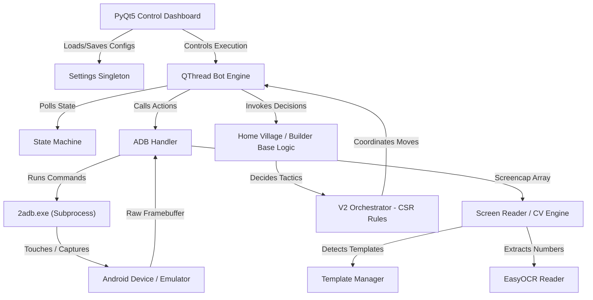

# 🤖 Clash of Clans Auto Farmer Bot

<div align="center">
  <a href="README.md">🇺🇸 English</a> | <a href="README_AR.md">🇸🇦 العربية</a>
</div>

<br />

<div align="center">
  
  
  
  
  
</div>

<br />

An advanced, non-intrusive auto-farming bot for **Clash of Clans**. Powered by high-precision computer vision (OpenCV template matching with scale-variance) and OCR (EasyOCR). It operates 100% safely via Android Debug Bridge (ADB) screenshot analysis and touch emulations, letting the game play itself to collect resources, train armies, and execute strategic attacks without modifying game files or injecting code.

---

> [!WARNING]
> **EDUCATIONAL & FAIR PLAY DISCLAIMER**
> This repository is a technical demonstration of PyQt5, OpenCV, and accessibility automation. It does **not** read game process memory, manipulate network packets, or modify game files. All actions are simulated at the OS level. However, using automated tools in online multiplayer games violates the publisher's Terms of Service and can result in account suspension. Use this framework responsibly and at your own risk.

---

## 🎮 What is this Bot? (For Players)

Tired of spending hours grinding for Gold, Elixir, and Dark Elixir? This bot acts as your **virtual gameplay assistant**, running on your computer and playing the game on an Android emulator exactly like a human player.

### 🌟 Key Player Features
- **Auto-Farming & Loot Filtering:** Scans bases using OCR to read available gold and elixir. If the loot is below your minimum settings, it automatically skips the base and searches for a richer target.
- **Smart Deployment & Strategic Attacks:** Drops troops, heroes, and spells based on real combat logic (avoids red zones, creates paths, and targets specific defenses).
- **Auto-Training:** Detects when you have no troops or are missing units, opening the training screen to queue up your predefined armies.
- **Hero Abilities Management:** Monitors heroes and double-taps their cards to activate their special abilities after a customizable delay or when their health drops.
- **Multi-Stage Builder Base (BB) Automation:** Searches for matches in the Builder Base, drops heroes and troops, activates abilities, and transitions automatically to Stage 2.
- **Anti-Stuck & Auto-Reload:** Automatically detects connection drops, clicks the "Reload" button, and handles unexpected popups to keep running 24/7.
- **Visual Macro Recorder:** Record your custom layouts (like collecting resources from collectors or navigating menus) and play them back with humanized timing.

---

## ⚔️ Available Attack Strategies

The bot features a **Config-Skills-Rules (CSR)** combat system that analyzes your army composition and targets to choose the best strategy.

| Attack Rule | Targeted Army Type | How it Works (Combat Mechanics) |
| :--- | :--- | :--- |
| **Resource Raid (Storage Farm)** | Cheap units (Barbarians, Goblins, Archers) | Scouts the base by dropping individual troops on storages to trigger traps, then unloads the main wave on the closest safe spot to grab the loot. |
| **Ground Funneling** | Tanky + DPS units (Giants/Golems + Wizards/P.E.K.K.As) | Drops tanks and support units on the left/right margins to clear outer buildings, creating a "funnel" that forces your main force to push straight to the center. |
| **Air Fan (Electro Dragon/Dragons)** | Air units (Dragons, E-Dragons, Balloons) | Deploys air units in a wide line along the safest corridor. Casts Rage and Freeze spells on Air Defenses, Inferno Towers, or Eagle Artilleries. |
| **Town Hall Snipe** | Any balanced army | Scans the playfield for the Town Hall. If it is placed near the outer edges, the bot deploys units along the closest safe path to secure a quick star. |
| **Smart Default** | Mixed / Unknown armies | Calculates the widest safe corridor outside the red zone boundaries and unloads all troops, heroes, and spells in a single organized wave. |

---

## 🛠️ System Architecture

This bot is divided into three distinct layers to ensure stability and flexibility:



---

## 📂 Project Directory Breakdown

```directory
.
├── 2adb.exe                      # Portable Android Debug Bridge (ADB) executable
├── AdbWinApi.dll                 # ADB communication helper library
├── AdbWinUsbApi.dll              # ADB USB driver interface library
├── main.py                       # App entry point (PyQt5 runner, log initialiser)
├── requirements.txt              # Complete Python dependency list
├── config/                       # Hot-reloadable V2 JSON configuration folder
│   ├── v2_attack_rules.json      # Global thresholds (standoff bounds, HSV filters)
│   ├── v2_spell_profiles.json    # Casting trajectories and triggers for spells
│   └── v2_troop_profiles.json    # Combat behavior specifications for troops
├── core/                         # Core execution & OS-level bridge
│   ├── adb_gestures.py           # Multi-touch simulation (zooming, camera panning)
│   ├── adb_handler.py            # Command runner, frame grabs, macro recorder
│   ├── bot_engine.py             # QThread scheduler driving the bot tick loop
│   ├── logger.py                 # File and console logger setup
│   ├── settings.py               # Settings registry loading/saving settings.json
│   └── state_machine.py          # Finite State Machine tracking game phases
├── logic/                        # High-level gameplay decision rules
│   ├── builder_base.py           # Builder base dual-stage attack routines
│   ├── home_village.py           # Main village farming routines
│   ├── smart_v2_logic.py         # Coordinator proxy for CSR engine & V36 fallbacks
│   ├── v2_orchestrator.py        # Hot-reload JSON loader & CSR rule selector
│   ├── rules/                    # Strategy algorithms
│   │   ├── air_attack_rule.py    # Deploys air units along safety vectors
│   │   ├── base_rule.py          # Abstract base class for attack rules
│   │   ├── ground_funnel_rule.py # Clears margins before launching central attacks
│   │   ├── resource_raid_rule.py # Attacks storages individually with cheap scouts
│   │   ├── smart_default_rule.py # Deploys army along widest safe corridor
│   │   └── th_snipe_rule.py      # targets nearest safe coordinates to Town Hall
│   └── skills/                   # Tactical planners
│       ├── fan_planner.py        # Computes linear/circular troop fan deployments
│       ├── funnel_planner.py     # Solves funnel paths along bases
│       ├── hero_planner.py       # Handles hero timing and ability sequences
│       ├── human_touch.py        # Coordinates delays and jitter offsets
│       └── spell_planner.py      # Trajects supporting spells onto unit clusters
├── profiles/                     # User Profiles
│   ├── default_profile.json      # Sample configuration file
│   └── settings.json             # Local options file (Excluded in git)
├── strategies/                   # Visual sequences
│   └── example_strategy.json     # Custom click flow sequences
├── ui/                           # Graphical Interface Components
│   ├── styles.py                 # Custom dark QSS stylesheet
│   ├── main_window.py            # Master control panel frame
│   └── widgets/                  # Individual tabs (Assets, Settings, Consoles)
└── vision/                       # Computer Vision & Image Segmentation
    ├── ocr_reader.py             # EasyOCR text reader & Binarization filter
    ├── screen_reader.py          # Grayscale template matcher
    ├── smart_vision_v2.py        # Red-zone contours detector
    ├── template_manager.py       # Manifest parser caching template assets
    └── skills/                   # Vision helpers
        ├── corner_selector.py    # Finds best corners for base angles
        ├── isometric_grid.py     # Maps 2D coordinates to 3D isometric cells
        ├── obstacle_detector.py  # Filters trees, stones, and decorations
        ├── red_zone_polygon.py   # Extracts red deployment zone coordinates
        ├── safe_corridor.py      # Finds paths avoiding red zones
        └── target_locator.py     # Searches for specific defense/resource targets
```

---

## 🛠️ Technical Deep Dive

### A. Computer Vision & Screen Analysis

The template matching subsystem resides in [screen_reader.py](file:///C:/Users/alisa/Desktop/Ai_Projects/COC%20(2)/vision/screen_reader.py). To bypass layout changes caused by different device screen ratios and resolutions:

1. **Multi-Scale Scaling Iteration:** Instead of performing a single search, the matching algorithm iterates over a list of floating-point scales (e.g. `[0.7, 0.8, 0.9, 1.0, 1.1]`) loaded dynamically from the settings profile.
2. **Region-of-Interest (ROI) Cropping:** To prevent false positives, matching regions are restricted. Troop cards are matches only in the bottom UI area, and defense targets are searched in the upper playfield area.
3. **Red-Zone Contour Parsing:**
   The algorithm isolates the red deployment line using HSV color filtering (focusing on red color ranges `[0, 70, 50]` to `[10, 255, 255]` combined with `[170, 70, 50]` to `[180, 255, 255]`). It applies a morphology closing operation with customized horizontal and vertical kernels to join fragmented lines into a continuous boundary contour, representing the deployment limits.

```python
# Morphology closing filter in screen_reader.py to extract red lines
mask = cv2.bitwise_or(m1, m2)
kernel = cv2.getStructuringElement(cv2.MORPH_ELLIPSE, (7, 7))
mask = cv2.morphologyEx(mask, cv2.MORPH_CLOSE, kernel, iterations=2)
```

---

### B. Localized Deep-Learning OCR Pipeline

The text recognition pipeline in [ocr_reader.py](file:///C:/Users/alisa/Desktop/Ai_Projects/COC%20(2)/vision/ocr_reader.py) is built around **EasyOCR** for localized data extraction:

```
[Raw Screen Frame] ➔ [Proportional ROI Crop] ➔ [Binarization & Otsu Threshold] ➔ [EasyOCR Scan] ➔ [Regex Digits Filter]
```

1. **Proportional ROI Crop:** The screen is cropped using percentages (e.g. top-left `0.10:0.32` Y-axis, `0.00:0.20` X-axis) to locate resource counters on varying display aspect ratios.
2. **Left-Side Crop (`LOOT_LEFT_CROP` = 0.35):** The gold, elixir, and dark elixir icons are cropped out, leaving only the text to avoid confusing the OCR engine.
3. **Binarization & Otsu Threshold:**
   The isolated crop is resized by `3x` using cubic interpolation to sharpen text edges. The image is converted to grayscale, and Otsu's thresholding is applied to segment numbers cleanly against complex background colors.
4. **Regex Post-Processing:**
   ```python
   digits = re.sub(r"\D", "", raw_text)
   value = int(digits) if digits else 0
   ```

---

### C. Control Engine & Humanization Constraints

The [adb_handler.py](file:///C:/Users/alisa/Desktop/Ai_Projects/COC%20(2)/core/adb_handler.py) controls inputs via `2adb.exe` subprocesses using the `CREATE_NO_WINDOW` flag, preventing command window popups on Windows.

To simulate human patterns and bypass bot-detection algorithms, input coordinates are processed through a humanization pipeline:

```
[Target Coordinate (X, Y)] 
           ↓
   [Apply Jitter Bounds]  ➔ Random offset (±3px to ±8px)
           ↓
 [Uniqueness Validator]  ➔ Verifies coordinates differ from the last tap
           ↓
 [Execute OS ADB Swipe]  ➔ Sends 'input swipe' with random hold duration (40ms - 120ms)
           ↓
  [Reaction Delay]       ➔ Pauses thread for random delay (100ms - 700ms)
```

For macro recording, the handler runs `adb shell getevent -t` in a background thread to intercept binary inputs from `/dev/input/event*`. It decodes the signals, filters for coordinate markers (`0035` for X, `0036` for Y, and `0000` for syn-reports), and records the inputs into JSON sequences.

---

### D. Config-Skills-Rules (CSR) Attack Dispatcher

The advanced attack dispatcher in [v2_orchestrator.py](file:///C:/Users/alisa/Desktop/Ai_Projects/COC%20(2)/logic/v2_orchestrator.py) uses a modular design to separate strategy rules from technical skills:

1. **Configuration Layer:** Stores settings for troops, spells, and base profiles in JSON configuration files.
2. **Skills Layer:** Implements standard planners:
   - `CornerSelectorSkill`: Finds base corners.
   - `IsometricGridSkill`: Maps flat coordinates to isometric grids.
   - `SafeCorridorSkill`: Finds paths avoiding red zones.
   - `FunnelPlannerSkill`: Generates deployment paths.
3. **Rules Layer:** Analyzes the active army composition to select the most appropriate deployment strategy:
   - Contains mostly air units ➔ `AirAttackRule`
   - Contains ground funneling units ➔ `GroundFunnelRule`
   - Target is a single building ➔ `THSnipeRule`
   - Target is a storage ➔ `ResourceRaidRule`
   - Fallback/Unknown composition ➔ `SmartDefaultRule`

---

### E. Double-Stage Builder Base (BB) Strategy

The Builder Base module in [builder_base.py](file:///C:/Users/alisa/Desktop/Ai_Projects/COC%20(2)/logic/builder_base.py) automates the unique dual-stage mechanics:

1. **Post-Hero Placement Re-scan:**
   Once a hero is dropped in Stage 1, the combat UI changes and health bars overlay cards. The bot captures a new screenshot immediately after dropping the hero. This updates template coordinates, allowing the bot to identify and select remaining troop cards.
2. **Long-Swipe Deployment:**
   Uses a continuous long-swipe gesture to unload troop containers at safe coordinates.
3. **Stage 2 Transition:**
   Checks for the `bb_stage2_indicator` template on the screen. When detected, it taps the transition button, resets the state tracker, and prepares for the second stage.
4. **Hero Ability Watchdog:**
   Monitors and triggers hero abilities based on user-defined intervals (e.g. `bb_hero_timer` seconds).

---

## 📦 Requirements & Pre-Requisites

Before setting up the bot, verify your configuration:

### 1. Emulator Settings
- **Resolution:** Must be set to exactly **1920x1080** (Landscape, 240 DPI).
- **Settings:** Ensure **ADB Connection / USB Debugging** is enabled in the emulator preferences.
- **Recommended Emulators:** LDPlayer 9 or BlueStacks 5.

### 2. PC Requirements
- **OS:** Windows 10 or 11 (64-bit).
- **Python:** Python `3.10` or `3.11` installed and added to your system `PATH`.
- **Hardware Virtualization:** Enable Virtualization Technology (VT) in your BIOS to improve OCR performance.

---

## 🚀 Step-by-Step Installation Guide

### Step 1: Clone the Project
Open PowerShell or Command Prompt and clone the repository:
```powershell
git clone https://github.com/alisakkaf/Clash-of-Clans-Bot-Auto-Farmer.git
cd Clash-of-Clans-Bot-Auto-Farmer
```

### Step 2: Set Up Python Virtual Environment
Creating a virtual environment isolates the bot dependencies:
```powershell
# Create environment
python -m venv venv

# Activate environment
venv\Scripts\activate
```

### Step 3: Install Dependencies
Install all required packages from `requirements.txt`:
```powershell
pip install --upgrade pip
pip install -r requirements.txt
```
> [!NOTE]
> On the first run, EasyOCR will download its English character recognition models (~15MB) to `~/.EasyOCR/`. Make sure your computer is connected to the internet.

### Step 4: Verify Connection
Launch your emulator, open your terminal, and run:
```powershell
.\2adb.exe devices
```
You should see your emulator listed as `device`:
```output
List of devices attached
127.0.0.1:5554   device
```

---

## 🖥️ Running the Application

1. Ensure your virtual environment is active:
   ```powershell
   venv\Scripts\activate
   ```
2. Launch the bot interface:
   ```powershell
   python main.py
   ```
3. **Configure Settings:**
   - Go to the **Settings** tab. Set your preferred tick intervals, matching thresholds, and target package names.
   - Go to **Home Village / Builder Base** tabs to choose which troops, heroes, and spells are selected for deployment.
4. **Calibrate Assets:**
   - If some buttons or troop cards are not detected, open the **Asset Manager** tab to calibrate templates or crop fresh icons.
5. **Start Farming:**
   - Open Clash of Clans on your emulator, go to your home village, and click the green **Start Bot** button on the console panel.

---

## 🎛️ Creating Custom Attack Configurations

You can customize troop drop orders and spell targets under `config/`:

### Troop Profiles (`config/v2_troop_profiles.json`)
```json
"electro_dragon": {
  "kind": "air",
  "style": "fan_wide",
  "deployment_spacing_ms": 250,
  "weight": 20
}
```
- **`kind`:** `ground` or `air`.
- **`style`:**
  - `fan_wide`: Spreads troops along a wide arc.
  - `cluster`: Drops all units on a single coordinate.
  - `scout_pairs`: Drops small groups of units to clear traps.
- **`deployment_spacing_ms`:** Delay between individual drops.

### Spell Profiles (`config/v2_spell_profiles.json`)
```json
"rage_spell": {
  "target_type": "path_fraction",
  "value": 0.65,
  "radius_px": 80
}
```
- **`target_type`:**
  - `path_fraction`: Casts spells at a fractional distance along the army's path.
  - `target_building`: Targets specific buildings (e.g. Eagle Artilleries or Air Defenses).

---

## 🔧 Troubleshooting & Diagnostics

### 1. EasyOCR/PyTorch GPU Hangs
- **Symptom:** The console freezes on `Initializing EasyOCR reader...`.
- **Fix:** If your computer does not have a dedicated NVIDIA GPU with CUDA, open [ocr_reader.py](file:///vision/ocr_reader.py) and change `gpu=True` to `gpu=False` on line 49:
  ```python
  _reader = easyocr.Reader(["en"], gpu=False, verbose=False)
  ```

### 2. ADB Device Not Found
- **Symptom:** Status shows `DISCONNECTED` or connection fails.
- **Fix:** Verify your emulator's developer settings. Connect manually by running:
  ```powershell
  .\2adb.exe connect 127.0.0.1:5554
  ```

### 3. Taps Clicking Wrong Areas
- **Symptom:** The bot clicks slightly off-target.
- **Fix:** Verify your emulator resolution is set to exactly **1920x1080** and DPI density is **240**.

---

## 🤝 Collaboration & Contribution

Want to help improve the bot? We welcome contributions!
1. Fork this repository.
2. Create a branch for your features: `git checkout -b feature/awesome-feature`
3. Commit your changes: `git commit -m "feat: add support for Siege Machines"`
4. Push and open a Pull Request.

---

## ⚖️ Safety, Policy & Legal Compliance

This framework complies with standard repository guidelines:
- **No Malware:** Contains no spyware, remote control payloads, or ads.
- **No Trademark Infringements:** Does not distribute game binaries or official intellectual property.
- **Liability Protection:** Distributed under the MIT license, shielding developers from gameplay-related issues or bans.

---

## 📜 License

This project is licensed under the **MIT License** - see the [LICENSE](file:///LICENSE) file for details. You are free to modify and distribute the codebase, provided that copyright notices are preserved and authors are excluded from liabilities.
