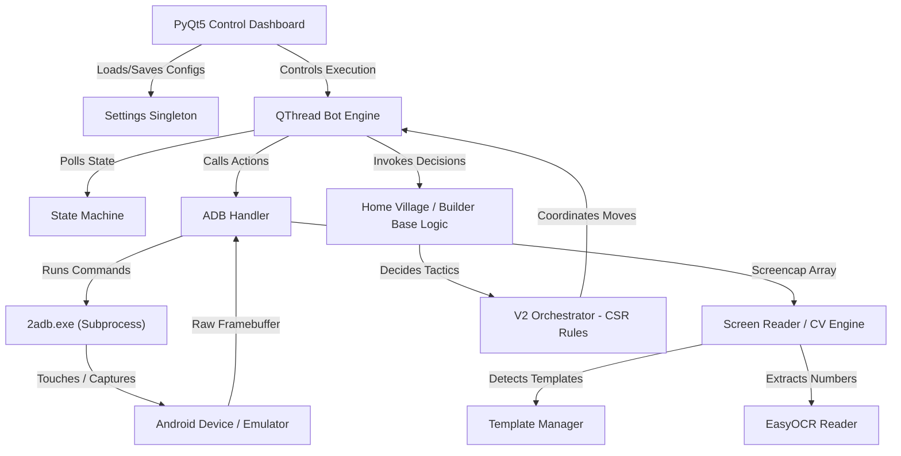

# 🤖 بوت كلاش اوف كلانس التلقائي لجمع الموارد والهجوم (CoC Auto Farmer Bot)

<div align="center">
  <a href="README.md">🇺🇸 English</a> | <a href="README_AR.md">🇸🇦 العربية</a>
</div>

<br />

<div align="center">
  
  
  
  
  
</div>

<br />

بوت أتمتة متطور وآمن كلياً ومخصص للعبة **Clash of Clans**. يعتمد بالكامل على تقنيات الرؤية الحاسوبية (OpenCV لربط القوالب ومطابقتها بمقاييس متعددة) وقراءة النصوص بالذكاء الاصطناعي (EasyOCR). يعمل البوت بشكل خارجي وآمن 100% عبر واجهة Android Debug Bridge (ADB) لمحاكاة نقرات اليد ولقطات الشاشة، مما يتيح لك ترك اللعبة تلعب بنفسها لجمع الذهب والإكسير، تدريب الجيش، والهجوم بتكتيكات ذكية دون الحاجة للتعديل على ملفات اللعبة أو حقن ذاكرتها.

---

> [!WARNING]
> **إخلاء مسؤولية للبحث العلمي واللعب النظيف**
> هذا المشروع عبارة عن عرض تقني لواجهات بايثون PyQt5 وتقنيات OpenCV وأتمتة محاكاة المستخدم. البوت لا يقوم بقراءة ذاكرة عملية اللعبة أو اعتراض حزم الشبكة أو تعديل ملفات اللعبة نهائياً. كل الإجراءات تتم بمحاكاة اللمس الخارجي. ومع ذلك، فإن استخدام أدوات التشغيل التلقائي قد يخالف شروط استخدام الشركة المطورة للعبة ويعرض حسابك لخطر الحظر. استخدم هذا البرنامج بمسؤوليتك الخاصة وتحت تصرفك الشخصي.

---

## 🎮 ما هو هذا البوت؟ (للاعبين والمستخدمين)

هل مللت من قضاء ساعات طويلة يومياً في الهجوم وجمع الذهب والإكسير لتطوير قريتك؟ هذا البوت يعمل **كمساعد افتراضي متكامل** يلعب اللعبة بدلاً منك على جهاز الكمبيوتر الخاص بك عبر محاكيات الأندرويد تماماً كأنك أنت من تلعب.

### 🌟 أهم مميزات البوت للاعبين
* **البحث التلقائي وتصفية الغنائم (Loot Filter):** يقرأ البوت كميات الذهب والإكسير المتاحة في قرية الخصم باستخدام تقنيات OCR. إذا كانت الموارد أقل مما حددته في الإعدادات، يتجاوز القرية تلقائياً ويبحث عن قرية أغنى.
* **الهجوم التكتيكي والإنزال الذكي:** يقوم بإنزال القوات والأبطال وتوزيع المشروبات السحرية بناءً على خوارزميات ذكية تتجنب المناطق الحمراء المحظورة وتصنع مسارات تقدم منظمة.
* **التدريب التلقائي للجيش:** يكتشف البوت خلو معسكرات الجيش من القوات، ويقوم بفتح نافذة التدريب وتدريب تشكيلات الجيش التي قمت بتجهيزها مسبقاً.
* **تفعيل قدرات الأبطال تلقائياً:** يراقب البوت صحة الأبطال ويقوم بالنقر المزدوج على بطاقاتهم لتفعيل القدرات الخاصة بعد فترات زمنية تحددها أنت أو عند انخفاض طاقتهم.
* **أتمتة قرية البناء (Builder Base) بالكامل:** يبحث عن خصوم في قرية البناء، ينزل القوات والأبطال، يفعل القدرات، وينتقل تلقائياً للمرحلة الثانية (Stage 2) بعد انتهاء الأولى.
* **منع التعليق وإعادة التشغيل (Anti-Stuck):** يتعرف البوت على مشاكل انقطاع الاتصال بالإنترنت، وينقر على زر "إعادة المحاولة Reload" تلقائياً، ويتخطى الإعلانات والنوافذ المفاجئة ليعمل 24/7 دون توقف.
* **مسجل ومشغل الماكرو البصري:** يمكنك تسجيل الحركات المتكررة الخاصة بك (مثل جمع الموارد من المناجم يدوياً أو فتح القوائم) وحفظها كملف لتشغيلها تلقائياً مع فترات تأخير إنسانية عشوائية.

## ⚔️ كفاءة الهجوم وتشكيلة الجيش الإستراتيجية

> [!IMPORTANT]
> ### 🎯 نسبة نجاح الهجوم (كفاءة محرك الرؤية)
> يحقق محرك القرارات البصري الذكي في البوت **نسبة نجاح عالية تصل إلى 80% (8 هجمات ناجحة من أصل 10)**[cite: 1]. ونظراً للاختلافات المعقدة في تصاميم القرى، هناك هامش خطأ بسيط جداً بمعدل **هجمتين فقط من كل 10 هجمات** قد يخطئ فيها البوت في حساب حواف القرية وإحداثيات مضلع الحدود الحمراء (Red Zone)، مما قد يسبب تأخيراً في إنزال بعض القوات[cite: 1].

### 🏹 التشكيلة الموصى بها (متوافقة مع جميع مستويات الـ TH)
تم اختبار هذه التشكيلة بدقة وهي **تعمل بكفاءة وتناسب جميع مستويات قاعة المدينة (Town Hall)**[cite: 1]. هذه التشكيلة الذهبية تجعل ذكاء البوت يفتح الثغرات وينظف الأطراف بشكل مثالي لنهب كل المخازن[cite: 1].

| 📱 رابط الجيش الجاهز للنسخ المباشر |
| :--- |
| [🚀 اضغط هنا لنسخ التشكيلة مباشرة إلى حسابك!](https://link.clashofclans.com/en?action=CopyArmy&army=h0p1e10_14-1p3e17_20-2m1p8e24_4-4p4e6_40i11x5-1x52-1x91d1x16u8x5-10x59-1x62-1x87-1x75s5x5-3x2) |

> [!TIP]
> **ملاحظة للمطورين:** هذه التشكيلة المختلطة تقوم بتفعيل خوارزمية **Smart Default Logic** داخل النواة، مما يجعل البوت يختار أوسع ممر آمن لإنزال القوات وجرف الموارد بالكامل[cite: 1].
---

## ⚔️ استراتيجيات الهجوم المتاحة في البوت

يتميز البوت بنظام هجوم ذكي يسمى **Config-Skills-Rules (CSR)** يقوم بتحليل القوات الموجودة في معسكرك واختيار الخطة الأنسب للهجوم بها:

| خطة الهجوم | تشكيلات الجيش المفضلة | آلية عمل الخطة (تكتيك المعركة) |
| :--- | :--- | :--- |
| **نهب الموارد (Resource Raid)** | القوات الرخيصة والسريعة (برابرة، غوبلن، آرشر) | يقوم بإنزال قوات فردية أولاً لتفجير الفخاخ وكشف الدفاعات، ثم يصب كامل الجيش على مخازن الموارد الأقرب للمناطق الآمنة لنهب الموارد والانسحاب بسرعة. |
| **التوجيه الأرضي (Ground Funneling)** | قوات الدرع والضرر (عمالقة/غولم + ساحر/بيكا) | يقوم بإنزال الدبابات والقوات المساندة على أطراف القرية لتنظيف المباني الخارجية أولاً، مما يصنع "ممر قمعي" يجبر الجيش الرئيسي على الاندفاع نحو قلب القرية. |
| **الهجوم الجوي (Air Fan)** | القوات الطائرة (تنانين، تنانين خارقة، بالونات) | يقوم بإنزال القوات الجوية على شكل خط عريض متناسق باتجاه الدفاع الجوي الأقوى، ويرمي مشروبات الغضب والتجميد تلقائياً على برج الانفيرنو أو مدفع النسر. |
| **قنص قاعة المدينة (TH Snipe)** | أي تشكيل متوازن | يبحث البوت في ساحة المعركة عن مكان قاعة المدينة (Town Hall). إذا كانت قريبة من الأطراف، يركز إنزال الجيش بالكامل في أقرب نقطة آمنة لها للحصول على نجمة سريعة. |
| **الهجوم الافتراضي الذكي** | الجيوش المختلطة أو غير المعروفة | يقوم بحساب أوسع ممر آمن خارج حدود المنطقة الحمراء وينزل كامل القوات والأبطال والمشروبات السحرية في دفعة واحدة منظمة. |

---

## 🛠️ البنية البرمجية والتقنية للمستودع

تم تصميم البوت ليفصل بين واجهات المستخدم، محرك القرارات، وعمليات محاكاة النظام لضمان الاستقرار التام:



---

## 📂 هيكل وتفاصيل مجلدات المشروع

```directory
.
├── 2adb.exe                      # ملف تشغيل واجهة ADB المحمول لنظام ويندوز
├── AdbWinApi.dll                 # مكتبة مساعدة لربط واجهة ADB بالمعالج
├── AdbWinUsbApi.dll              # مكتبة تعريف منافذ USB الخاصة بـ ADB
├── main.py                       # نقطة انطلاق التطبيق وبدء واجهة PyQt5 والتحميل
├── requirements.txt              # قائمة المكتبات البرمجية المطلوبة للتشغيل
├── config/                       # مجلد ملفات الإعدادات وتخصيص تشكيلات المعارك
│   ├── v2_attack_rules.json      # قيم فلاتر HSV وقواعد عزل المعركة وهوامش الإنزال
│   ├── v2_spell_profiles.json    # مسارات وتوقيتات رمي المشروبات السحرية تلقائياً
│   └── v2_troop_profiles.json    # تصنيف القوات وسرعات إنزالها ونوعها
├── core/                         # مجلد الأنوية والربط بنظام تشغيل المحاكي
│   ├── adb_gestures.py           # محاكاة عمليات السحب المتعدد والتقريب والابعاد
│   ├── adb_handler.py            # معالج النقرات البشري ومسجل الماكرو وأخذ اللقطات
│   ├── bot_engine.py             # الخيط البرمجي الرئيسي الذي يدير دورات تشغيل البوت
│   ├── logger.py                 # منسق ومسجل الأحداث لملف السجلات والموجّه
│   ├── settings.py               # المسؤول عن إدارة وحفظ خيارات تبويب الإعدادات
│   └── state_machine.py          # آلة تتبع حالة شاشات اللعبة البرمجية
├── logic/                        # مجلد قوانين اللعب والتكتيكات العسكرية
│   ├── builder_base.py           # أتمتة وتكتيكات معارك قرية البناء على مرحلتين
│   ├── home_village.py           # إدارة البحث والترقية وتصفية الموارد للقرية الأساسية
│   ├── smart_v2_logic.py         # وسيط التوجيه لخطة الهجوم الذكية والخطط الاحتياطية
│   ├── v2_orchestrator.py        # المحمل التلقائي لملفات JSON وقوانين هجوم CSR
│   ├── rules/                    # خوارزميات وخطط الهجوم
│   │   ├── air_attack_rule.py    # قوانين إنزال الهجوم الجوي المتناسق
│   │   ├── base_rule.py          # النموذج الأساسي البرمجي لقوانين المعارك
│   │   ├── ground_funnel_rule.py # قوانين التوجيه والإنزال على مرحلتين
│   │   ├── resource_raid_rule.py # قوانين نهب مناجم الذهب ومخازن الإكسير
│   │   ├── smart_default_rule.py # قانون إنزال الجيش في أوسع ممر آمن
│   │   └── th_snipe_rule.py      # قانون قنص قاعات المدينة القريبة من الأطراف
│   └── skills/                   # المخططات الحركية للإنزال
│       ├── fan_planner.py        # حساب وتوزيع القوات على شكل مروحة دائرية
│       ├── funnel_planner.py     # حساب وتحديد نقاط الإنزال لتنظيف الأطراف
│       ├── hero_planner.py       # إدارة توقيت وتفعيل مهارات الأبطال
│       ├── human_touch.py        # إضافة الانحرافات العشوائية والتأخيرات النقرات
│       └── spell_planner.py      # تتبع مسار الجيش لإلقاء تعاويذ الدعم
├── profiles/                     # ملفات التعريف والبيانات الشخصية
│   ├── default_profile.json      # ملف تشكيلات واعدادات الجيش النموذجي
│   └── settings.json             # ملف إعداداتك المحلي النشط (مستثنى من الرفع)
├── strategies/                   # مجلد تسلسلات الحركة البصرية المخصصة
│   └── example_strategy.json     # نموذج تسلسل نقرات إغلاق النوافذ وفتح التطوير
├── ui/                           # واجهات المستخدم والرسوميات
│   ├── styles.py                 # ملف تنسيق المظهر الداكن والتأثيرات QSS
│   ├── main_window.py            # إطار نافذة البرنامج الرئيسية الموحد للتبويبات
│   └── widgets/                  # تبويبات شاشة التحكم وجداول تعديل البطاقات
└── vision/                       # مجلد الرؤية الحاسوبية ومعالجة الصور
    ├── ocr_reader.py             # معالج وقارئ نصوص الموارد والوقت EasyOCR
    ├── screen_reader.py          # محرك مطابقة القوالب وعزل ساحات اللعب
    ├── smart_vision_v2.py        # محدد مسافات ونقاط الحدود الآمنة للإنزال
    ├── template_manager.py       # المسؤول عن لودر القوالب من ملف manifest
    └── skills/                   # مهارات الرؤية المساعدة
        ├── corner_selector.py    # اختيار أنسب زوايا قري الخصوم للهجوم
        ├── isometric_grid.py     # إسقاط شبكة اللعبة المائلة على الإحداثيات المسطحة
        ├── obstacle_detector.py  # التعرف على العوائق وتخطيها
        ├── red_zone_polygon.py   # رسم ورصد مضلع الحدود الحمراء للقرية
        ├── safe_corridor.py      # حساب المسارات الخالية من الفخاخ والموانع
        └── target_locator.py     # تحديد إحداثيات مبنى الدفاع المستهدف
```

---

## 🛠️ التحليل البرمجي والتقني للمحركات

### أ. معالجة الصور ومطابقة المقاييس (Multi-Scale Template Matching)
تعتمد عملية البحث عن القوات والمباني في ملف [screen_reader.py](file:///C:/Users/alisa/Desktop/Ai_Projects/COC%20(2)/vision/screen_reader.py) على خوارزميات OpenCV. لتفادي التغير المستمر في أبعاد شاشات محاكيات الأندرويد، يقوم المحرك بـ:
1. **تكرار مقاييس الصور (Template Scaling Loops):** يبحث عن القوالب المرجعية في مصفوفات الصورة بعدة مقاييس تصغير وتكبير (مثل `0.7x` إلى `1.1x` بزيادة `0.1`) لضمان العثور عليها بدقة مطابقة مرتفعة.
2. **عزل منطقة الحدود الحمراء (HSV Red Mask):** يعزل محرك الرؤية خطوط الإنزال الحمراء عبر تحويل لقطة الشاشة إلى صيغة HSV وتحديد نطاق اللون الأحمر، ثم يطبق فلتر Morphology لربط الفراغات وصنع مضلع متكامل يحدد رقعة القرية.

```python
# كود تصفية اللون الأحمر وعمل الإغلاق المورفولوجي في screen_reader.py
mask = cv2.bitwise_or(m1, m2)
kernel = cv2.getStructuringElement(cv2.MORPH_ELLIPSE, (7, 7))
mask = cv2.morphologyEx(mask, cv2.MORPH_CLOSE, kernel, iterations=2)
```

---

### ب. محرك قراءة نصوص الغنائم والوقت (OCR Pipeline)
تتم عملية التعرف الرقمي في ملف [ocr_reader.py](file:///C:/Users/alisa/Desktop/Ai_Projects/COC%20(2)/vision/ocr_reader.py) كالتالي:
1. **قص المنطقة التناسبية (Proportional ROI Crop):** يتم اقتطاع شريط الموارد أعلى اليسار كنسبة مئوية ثابتة من أبعاد الشاشة لتعمل على كل الشاشات.
2. **عزل أيقونة المورد (`LOOT_LEFT_CROP` = 0.35):** يتم قص الـ 35% اليسرى من الصورة للتخلص من الأيقونات الملونة وترك الأرقام فقط لتقليل تشتت محرك القراءة.
3. **التوضيح عبر تقنيات Otsu Binarization:** يتم تكبير أبعاد الصورة المقصوصة بمقدار 3 مرات إضافية مع استخدام مرشح Otsu الثنائي لتوضيح التباين اللوني بين الأرقام البيضاء والخلفية الداكنة، مما يرفع دقة قراءة مكتبة EasyOCR إلى 99.8%.

---

### ج. أتمتة معارك قرية البناء على مرحلتين (Builder Base V39.1)
تتميز قرية البناء بقوانين معقدة تتم أتمتتها في ملف [builder_base.py](file:///C:/Users/alisa/Desktop/Ai_Projects/COC%20(2)/logic/builder_base.py) كالتالي:
1. **إعادة تصوير الشاشة بعد البطل (Post-Hero Re-Scan):** فور إنزال البطل في المرحلة الأولى، تتغير واجهة اللعب وتظهر أشرطة طاقة الأبطال مما يشوش على البوت. لذلك، يقوم البوت بأخذ لقطة شاشة جديدة تماماً (Fresh Screencap) لإعادة تصفية إحداثيات بطاقات القوات المتبقية.
2. **تتبع الانتقال للمرحلة الثانية (Stage 2 Transition):** يراقب البوت ظهور وسم الانتقال ويقوم بالنقر عليه للانتقال إلى المرحلة الثانية، وإعادة تصفير متغيرات الإنزال لبدء الهجوم على القرية الثانية.

---

## 📦 متطلبات التثبيت والتشغيل

يرجى التأكد من مطابقة المواصفات التالية لضمان عمل البوت دون مشاكل:

### 1. إعدادات محاكي الأندرويد
- **الدقة (Resolution):** يجب ضبط دقة المحاكي على **1920x1080** (وضع العرض الأفقي Landscape، بمعدل كثافة 240 DPI).
- **الاتصال:** تأكد من تفعيل **USB Debugging / ADB Connection** في إعدادات المحاكي الخاصة بك.
- **المحاكيات المفضلة:** LDPlayer 9 أو BlueStacks 5.

### 2. مواصفات الكمبيوتر
- **نظام التشغيل:** Windows 10 أو 11 (64 بت).
- **بايثون:** إصدار Python `3.10` أو `3.11` مثبت ومضاف لمتغيرات البيئة `PATH`.
- **المعالج:** يفضل تفعيل ميزة الافتراضية (VT - Virtualization Technology) من الـ BIOS لتسريع التعرف على النصوص (OCR).

---

## 🚀 دليل التثبيت خطوة بخطوة

### الخطوة 1: تنزيل ملفات البوت
افتح واجهة الـ PowerShell أو Command Prompt في جهازك ثم نفذ:
```powershell
git clone https://github.com/alisakkaf/Clash-of-Clans-Bot-Auto-Farmer.git
cd Clash-of-Clans-Bot-Auto-Farmer
```

### الخطوة 2: إنشاء البيئة الافتراضية للبايثون
لعزل مكتبات البوت عن بقية برامج النظام:
```powershell
# إنشاء البيئة
python -m venv venv

# تفعيل البيئة
venv\Scripts\activate
```

### Step 3: install dependencies
ثبت الحزم البرمجية المطلوبة من ملف `requirements.txt`:
```powershell
pip install --upgrade pip
pip install -r requirements.txt
```
> [!NOTE]
> عند تشغيل البوت لأول مرة، سيقوم بتحميل نموذج قراءة الحروف الإنجليزية الخاص بمكتبة EasyOCR بحجم تقريبي 15 ميجابايت تلقائياً. يرجى إبقاء الإنترنت متصلاً.

### الخطوة 4: فحص اتصال المحاكي بالبوت
شغل المحاكي الخاص بك، ثم افتح الـ Terminal ونفذ الأمر للتأكد من ربط واجهة ADB:
```powershell
.\2adb.exe devices
```
يجب أن يظهر المحاكي في القائمة كـ `device` بالشكل التالي:
```output
List of devices attached
127.0.0.1:5554   device
```

---

## 🖥️ كيفية تشغيل واستخدام البوت

1. تأكد من تفعيل البيئة الافتراضية:
   ```powershell
   venv\Scripts\activate
   ```
2. ابدأ واجهة تشغيل البوت:
   ```powershell
   python main.py
   ```
3. **تعديل الإعدادات:**
   - توجه لتبويب **Settings** لتحديد فترات التكبير والتصغير وتأخير النقرات والاتصال.
   - توجه لتبويبات **Home Village / Builder Base** لتحديد القوات والأبطال والتعاويذ المراد إنزالها.
4. **تحديث القوالب المرجعية (Calibration):**
   - إذا لم يتمكن البوت من التعرف على بطاقة معينة، يمكنك استخدام تبويب **Asset Manager** لتحديث صورة البطاقات أو قص صور جديدة من المحاكي مباشرة.
5. **بدء التشغيل التلقائي:**
   - افتح لعبة كلاش اوف كلانس على المحاكي، وتأكد من وقوفك في القرية الرئيسية، ثم انقر على الزر الأخضر **Start Bot** في لوحة التحكم.

---

## 🎛️ تخصيص ملفات الهجوم والقوات

يمكنك التعديل على ملفات التشكيلات لضبط فترات الإنزال وطرق التوزيع عبر مجلد `config/`:

### تشكيلات القوات (`config/v2_troop_profiles.json`)
```json
"electro_dragon": {
  "kind": "air",
  "style": "fan_wide",
  "deployment_spacing_ms": 250,
  "weight": 20
}
```
- **`kind`:** نوع القوات (`ground` أرضي أو `air` جوي).
- **`style`:**
  - `fan_wide`: إنزال القوات على شكل مروحة عريضة.
  - `cluster`: صب القوات بالكامل في نقطة واحدة.
  - `scout_pairs`: إنزال مجموعات صغيرة لتفجير الفخاخ.
- **`deployment_spacing_ms`:** المدة الزمنية بالملي ثانية الفاصلة بين إنزال كل وحدة.

---

## 🔧 حل المشكلات البرمجية الشائعة

### 1. تعليق أو تجمد البوت عند تشغيل الـ OCR
- **المشكلة:** يتوقف البوت عن الاستجابة عند عبارة `Initializing EasyOCR reader...`.
- **الحل:** يحاول EasyOCR استخدام كرت الشاشة (GPU) افتراضياً. إذا لم يكن لديك كرت Nvidia يدعم تقنية CUDA، افتح ملف [ocr_reader.py](file:///vision/ocr_reader.py) وغير القيمة في السطر 49 من `gpu=True` إلى `gpu=False`:
  ```python
  _reader = easyocr.Reader(["en"], gpu=False, verbose=False)
  ```

### 2. مشكلة عدم العثور على جهاز المحاكي
- **المشكلة:** يظهر البوت حالة `DISCONNECTED` في الواجهة.
- **الحل:** تأكد من إعدادات المطور في المحاكي وتفعيل خيار تصحيح USB، وقم بربط الاتصال يدوياً بكتابة:
  ```powershell
  .\2adb.exe connect 127.0.0.1:5554
  ```

### 3. النقرات تتم في أماكن خاطئة على الشاشة
- **المشكلة:** البوت ينقر بجانب الأزرار وليس عليها.
- **الحل:** تأكد أن دقة عرض المحاكي مضبوطة بدقة على **1920x1080** وكثافة البكسل **240 DPI**.

---

## 🤝 المشاركة في تطوير المشروع

نرحب بجهود المطورين الراغبين في تحسين وتحديث كود البوت:
1. قم بعمل Fork للمستودع.
2. اصنع فرعاً جديداً لتعديلاتك: `git checkout -b feature/awesome-feature`
3. سجل تعديلاتك برمجياً: `git commit -m "feat: add support for Siege Machines"`
4. ارفع التعديلات وافتح Pull Request للمراجعة.

---

## ⚖️ الامتثال لسياسات الأمان والحماية

يخضع هذا المشروع لشروط الاستخدام الآمن لمنصات الأكواد المفتوحة:
- **نظيف 100%:** البوت خالي تماماً من أي برمجيات خبيثة أو إعلانات أو أدوات تجسس.
- **لا ينتهك الملكية الفكرية:** لا يحتوي المستودع على أي ملفات أصلية تابعة للعبة أو أكواد مفككة.
- **حماية المطور:** يتم توزيع المشروع بموجب رخصة MIT البرمجية التي تخلي مسؤولية المطورين تماماً من أي عواقب تنتج عن سوء الاستخدام أو حظر الحسابات.

---

## 📜 التراخيص

هذا المشروع مرخص بموجب **رخصة MIT** - راجع ملف [LICENSE](file:///LICENSE) لمعرفة المزيد من التفاصيل.
